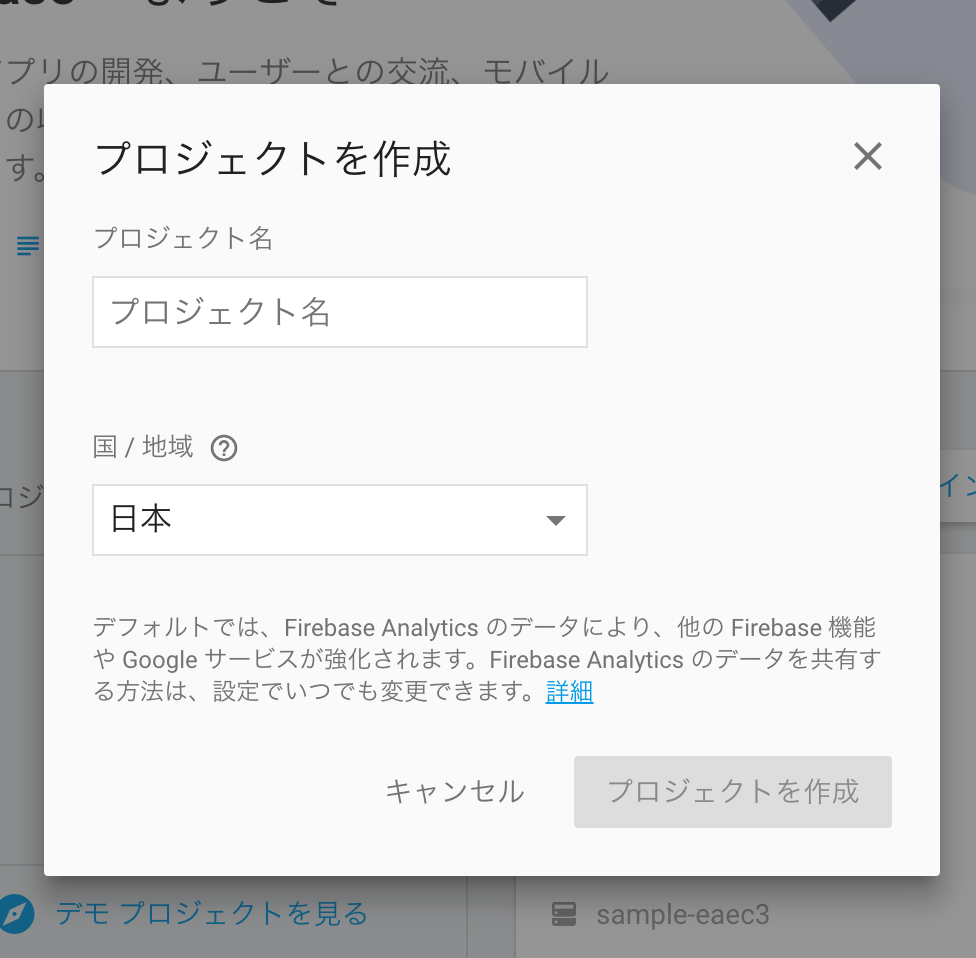

# PolymerFirebaseCodelab

PolymerFirebaseCodelab polymerfire version

このリポジトリは、Google Code Labs の 
[Interacting with data using the <firebase-element>](https://codelabs.developers.google.com/codelabs/polymer-firebase/index.html)
の `4. Connect with Firebase` から `7. Using Google login` までの流れについて、現時点で動作するようにしたサンプルプログラムです。

## 4。Firebaseと接続する

いよいよ Firebase と連携します！

### Firebaseインスタンスの作成

1. https://www.firebase.com にアクセスしてください
1. アカウントを作成する。「無料で開始」をクリックして新しいアカウントを作成するか、「ログイン」をクリックしてGoogleアカウントを使用してログインすることができます。
1. ダッシュボードで、新しいFirebaseアプリを作成します。`プロジェクト名` を入力し、`国` を選択する必要があります。

1. 新しく作成したプロジェクトをクリックすると、アプリのダッシュボードが開きます。

### 匿名ログインの許可

ひとまず、アプリケーションへの匿名ログインを許可します。
前の手順で作成した Firebaseインスタンスのダッシュボードを開き、`Authentication` から `ログイン方法` に移動して 匿名ログインを有効にします。


### polymerfire-element を追加する

これで、Firebaseアプリケーションを自由に使用できます。
実際に使用するには、対応する polymerfire-element を追加する必要があります。
bower.jsonを開き、polymerfire-element を `dependencies` に追加します。
`dependencies` は後で次のようになります。

#### bower.json

```json
"dependencies": {
  "iron-elements": "PolymerElements/iron-elements#^1.0.0",
  "paper-elements": "PolymerElements/paper-elements#^1.0.1",
  "polymerfire": "firebase/polymerfire#^0.10.3"
}
```

その後、bower_components フォルダを右クリックし、[ Bower Install ]をクリックします。
Chrome Dev Editorは、すべての依存関係をダウンロードしてインストールします。


次のインポートを追加します。

#### index.html

```html
<link rel="import" href="bower_components/polymerfire/firebase-app.html">
<link rel="import" href="bower_components/polymerfire/firebase-auth.html">
<link rel="import" href="bower_components/polymerfire/firebase-document.html">
<link rel="import" href="bower_components/polymerfire/firebase-query.html">
```

Firebaseに接続するための変数を設定します。
Firebaseインスタンスのダッシュボードを開き、`Authentication` から `ウェブ設定` をクリックして表示された画面のとおり設定した
<firebase-app> エレメントを追加します。


```html
<firebase-app
  auth-domain="YOUR-FIREBASE-ID.firebaseapp.com"
  database-url="https://YOUR-FIREBASE-ID.firebaseio.com"
  api-key="YOUR-API-KEY"
  storage-bucket="YOUR-FIREBASE-ID.appspot.com"
  messaging-sender-id="YOUR-SENDER-ID">
</firebase-app>
```
必要に応じてURLを調整してください。

Firebase に匿名ログインできるように、app 変数宣言のすぐ下に次のコードを追加します。

#### main.js

```js
app.firebaseProvider = 'anonymous';
```

ユーザーを認証するには、<firebase-auth> 要素を使用します。
簡単にするために、ログインボタンを用意して、クリックされたらログインするようにします。

<dom-repeat> エレメントの下に追加します。

#### index.html

```html
<paper-button on-click="login">login</paper-button>
<firebase-auth
  provider="[[firebaseProvider]]"
  user="{{user}}"
  on-error="handleError"></firebase-auth>
```

`on-rerror` で認証プロセス中に発生したエラーを表示します。
ログインが成功すると、`user` にユーザー情報が入ります。
この変更を利用してFirebaseエレメントのデータを取得します。

ログインに必要な2つのスクリプトをファイルの最後に追加します。

#### main.js

```js
app.login = function() {
  var auth = document.querySelector('firebase-auth');
  if (!auth.signedIn) {
    auth.signInWithRedirect();
  }
};
app.handleError = function(event) {
  console.log(event);  
};
```

